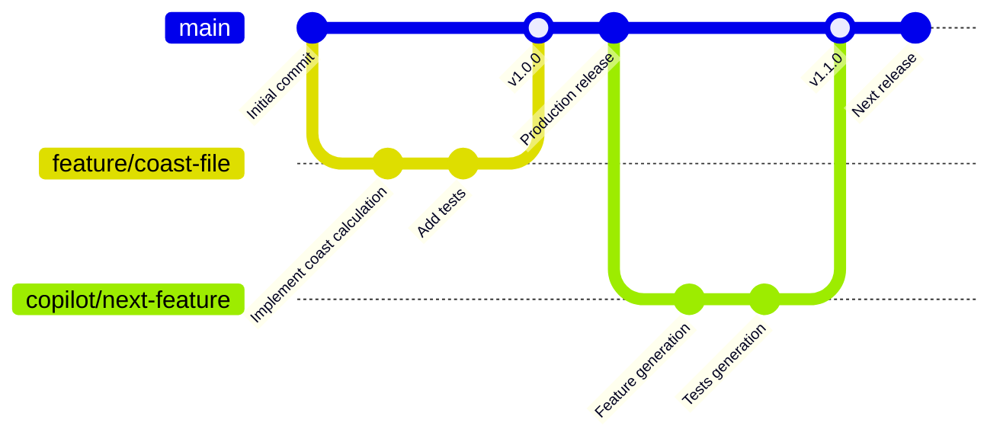

# ブランチ戦略 - GitHub Flow

## 概要

Life Planning Appは**GitHub Flow**を採用しています。これはシンプルながら強力な戦略で、継続的なデプロイメントと素早いリリースに最適化されています。

## ブランチ構成



### ブランチ説明

| ブランチ | 説明 | 作成者 |
|--------|------|------|
| **main** | 本番環境デプロイ対象 | - |
| **feature/*** | フィーチャー開発・バグ修正・緊急パッチ | 👤 Human |
| **copilot/*** | Copilot による自動実装・修正 | 🤖 Copilot |

## ワークフロー（統一モデル）

**全ての作業**（機能開発・バグ修正・パッチ）は以下の同じフロー：

### 基本ステップ

```
1. ブランチ作成
   git checkout main
   git pull origin main
   git checkout -b [feature/xxx | copilot/xxx]

2. 実装＆コミット
   （人間が開発 OR Copilot が自動生成）

3. PR 作成・レビュー
   - main へのマージを対象
   - CI/CD テスト確認
   - コードレビュー実施

4. マージ＆リリース
   git checkout main
   git pull
   git merge [ブランチ名]
   git tag -a v[version] -m "Release"
   git push origin main --tags
```

### 人間 vs Copilot

| 項目 | 人間 (feature/) | Copilot (copilot/) |
|------|---|---|
| ブランチ | `feature/xxx` | `copilot/xxx` |
| 実装方法 | ローカル開発・手動コミット | 自動コード生成 |
| PR 作成 | 手動作成 | 自動作成 |
| マージ処理 | 手動実行 | 自動実行 |

### リリース

main へマージされた時点で自動的にリリース準備開始：
- 新バージョン: Feature マージ → v1.x.0 (Minor)
- パッチ版: バグ修正 → v1.0.x (Patch)
- CHANGELOG.md を更新後、デプロイメント実行

## ネーミング規則

### ブランチ名

```
feature/説明 (人間が作成)
  例: feature/user-authentication
  例: feature/coast-file-calculation
  例: feature/fix-login-redirect
  例: feature/security-patch

copilot/説明 (Copilot が自動作成)
  例: copilot/coast-file-calculation
  例: copilot/unit-tests
  例: copilot/fix-parsing-bug
```

### コミットメッセージ

Conventional Commits 形式を採用：

```
<type>(<scope>): <subject>

<body>

<footer>
```

#### Type 種別

- **feat**: 新機能
- **fix**: バグ修正
- **docs**: ドキュメント更新
- **style**: コード整形（ロジック変更なし）
- **refactor**: コード リファクタリング
- **perf**: パフォーマンス改善
- **test**: テスト追加・修正
- **chore**: ビルド・依存関係・ツール設定

#### 例

```
feat(coast-file): implement retirement calculation engine

- Calculate pension eligibility and amount
- Calculate iDeCo contribution requirements
- Define coast FI target by age 60

Closes #123
```

## CI/CD パイプライン

### トリガー

| イベント | ブランチ | アクション |
|----------|---------|----------|
| Pull Request 作成 | feature/*, copilot/* | テスト実行、ビルド検証 |
| Push to main | main | 本番デプロイメント、リリース準備 |
| Tag 作成 | main | リリースビルド |

### チェック項目

- ✅ ユニットテスト合格
- ✅ 統合テスト合格
- ✅ セキュリティスキャン
- ✅ コード品質基準

## 保護ルール

### main ブランチ

- 直接プッシュ禁止（PRのみ）
- PRは最低1人以上のレビューが必須
- CI/CD パイプライン成功が必須
- マージ前にブランチを最新に同期必須

## Release Cycle

**基本方針:**
- main ブランチへのマージ → 新バージョン候補（Staging デプロイ）
- Git Tag 作成（v1.0.0 等）→ Production リリース
- Semantic Versioning 採用（v[Major].[Minor].[Patch]）
- CHANGELOG.md で変更内容を記録

**フレームワーク:** Flutter（Web + iOS + Android）

**デプロイメント詳細:**
→ [docs/deployment-flow.md](docs/deployment-flow.md) を参照

**フェーズ計画:**
→ 別ドキュメント作成予定 (TBD)

## チーム構成と責務

| 役割 | 責務 |
|------|------|
| **開発者** | フィーチャー開発、PR作成、ローカルテスト |
| **🤖 Copilot** | 自動コード生成、テスト生成、実装の自動化 |
| **レビュアー** | コードレビュー（Human/Copilot両方）、品質基準確認 |
| **QA** | UI テスト、統合テスト検証 |
| **DevOps** | CI/CDパイプライン管理、Staging/Production デプロイ |

## Reference

- [GitHub Flow Guide](https://guides.github.com/introduction/flow/)
- [Conventional Commits](https://www.conventionalcommits.org/)
- [Semantic Versioning](https://semver.org/)
