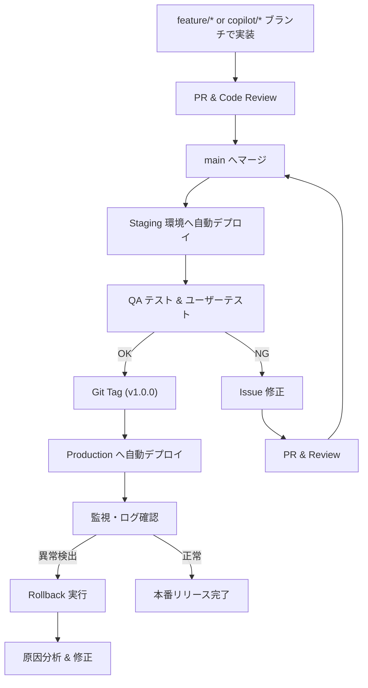

# デプロイメントフロー

## デプロイメント戦略

- **フレームワーク**: Flutter (Web + iOS + Android 統一)
- **main ブランチへのマージ**: Staging 環境へのデプロイ
- **Git Tag 作成**: Production 環境へのデプロイ
- **Version 管理**: Semantic Versioning (v1.0.0, v1.1.0, v1.0.1 等)
- **Rollback 手順**: Production デプロイ時のロールバック対応

## 環境

### Staging 環境
- 本番前の最終検証用
- main ブランチへのマージで自動デプロイ
- 品質確認・ユーザーテスト実施

### Production 環境
- 本番環境（顧客向け）
- Git Tag 作成で自動デプロイ
- 厳密なバージョン管理

## デプロイメント プラットフォーム

### Web (Flutter Web)
- ホスティング: Cloudflare Pages
- デプロイ トリガー:
  - **Staging**: `main` ブランチへの push → `deploy-staging.yml` が `cloudflare/wrangler-action@v3` で自動デプロイ
  - **Production**: `v*.*.*` タグ push → `deploy-production.yml` が自動デプロイ
- 必要な Secrets: `CLOUDFLARE_API_TOKEN`, `CLOUDFLARE_ACCOUNT_ID`
- **ローカルテスト環境ポート**: 30000（固定）
  - ローカルテスト起動コマンド: `./run-local-test.sh` または `flutter run -d chrome --web-port 30000`

### iOS (Flutter iOS)
- ホスティング: AppStore
- デプロイ トリガー: `v*.*.*` タグ push → GitHub Actions + Fastlane + AppStore Connect API（実装予定）
- 必要な Secrets: `APP_STORE_CONNECT_API_KEY_ID`, `APP_STORE_CONNECT_API_ISSUER_ID`, `APP_STORE_CONNECT_API_KEY_CONTENT`

### Android (Flutter Android)
- ホスティング: Google Play
- デプロイ トリガー: `v*.*.*` タグ push → GitHub Actions + Google Play Console API（実装予定）
- 必要な Secrets: `GOOGLE_PLAY_SERVICE_ACCOUNT_JSON`

## デプロイメント パイプライン

### CI/CD Tool
- **Web**: Cloudflare Pages (自動デプロイ)
- **iOS**: GitHub Actions + AppStore Connect
- **Android**: GitHub Actions + Google Play Console

### デプロイ トリガー
- **Staging**: main ブランチへのマージで自動トリガー
- **Production**: Git Tag 作成で自動トリガー

### ロールバック 手順
- 本番デプロイ後は即座に監視を開始
- 異常検出時は自動/手動ロールバック実行
- 前バージョンへの復帰手順（Cloudflare / AppStore 側の機能活用）

### 監視・アラート
- Application Insights: エラーログ、パフォーマンス監視
- Slack 通知: デプロイ完了・エラー検出時の通知
- ログ分析: 本番環境の動作確認

## Secrets セットアップガイド

### GitHub Repository Secrets に設定が必要な値

| Secret 名 | 用途 | 取得方法 |
|---|---|---|
| `CLOUDFLARE_API_TOKEN` | Cloudflare Pages デプロイ | Cloudflare Dashboard → My Profile → API Tokens → Edit Cloudflare Workers テンプレートで作成 |
| `CLOUDFLARE_ACCOUNT_ID` | Cloudflare アカウント識別 | Cloudflare Dashboard → 右サイドバー → Account ID |
| `APP_STORE_CONNECT_API_KEY_ID` | AppStore デプロイ（実装予定） | App Store Connect → Users and Access → Keys |
| `APP_STORE_CONNECT_API_ISSUER_ID` | AppStore デプロイ（実装予定） | App Store Connect → Users and Access → Keys |
| `APP_STORE_CONNECT_API_KEY_CONTENT` | AppStore デプロイ（実装予定） | App Store Connect からダウンロードした .p8 ファイルの内容 |
| `GOOGLE_PLAY_SERVICE_ACCOUNT_JSON` | Google Play デプロイ（実装予定） | Google Play Console → Setup → API access → Service accounts |

> `GITHUB_TOKEN` は GitHub Actions が自動で提供するため設定不要。

---

**Status**: Web デプロイ実装済み (iOS/Android TBD)
